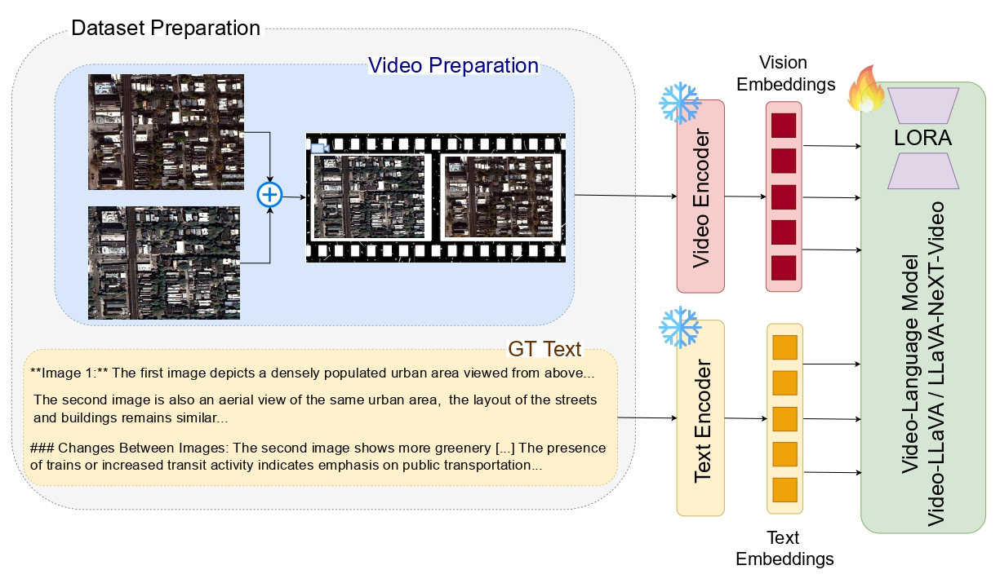

# GeoLLaVA: Efficient Fine-Tuned Vision-Language Models for Temporal Change Detection in Remote Sensing 🌍

GeoLLaVA is designed to enhance vision-language models (VLMs) for detecting temporal changes in remote sensing data. By leveraging fine-tuning techniques like LoRA and QLoRA, it significantly improves model performance in tasks such as environmental monitoring and urban planning, especially in detecting geographical landscape evolution over time.

#### [Hosam Elgendy](), [Ahmed Sharshar](), [Ahmed Aboeitta](), [Yasser Ashraf]() and [Mohsen Guizani]()
#### Mohamed bin Zayed University of AI (MBZUAI)

---
<p align='center'>

</p>

---

## Contents
- [Setup](#setup)
- [Dataset](#dataset)
- [Training](#training)
- [Evaluation](#evaluation)
- [Results](#results)
- [Acknowledgments](#acknowledgments)

---

## Setup

1. Clone this repository:
    ```shell
    git clone https://github.com/HosamGen/GeoLLaVA.git
    cd GeoLLaVA
    ```

2. Install the necessary dependencies:
    ```shell
    conda create -n geollava python=3.10
    conda activate geollava
    pip install -r requirements.txt
    ```

---

## GeoLLaVA Custom Dataset

[OPTIONAL] Please refer to the [fMoW dataset](https://github.com/fMoW/dataset?tab=readme-ov-file) for the original remote sensing dataset. We provide cleaned annotations in the [Annotations]() section below.

> **Note:** The full 100K annotations are too large for direct download and can be accessed via [Drive](https://mbzuaiac-my.sharepoint.com/:f:/g/personal/hosam_elgendy_mbzuai_ac_ae/Es2IRaXpBPRAk2gX6J5IDsgBBttITHCHbxpr4FIcRVWleg?e=pCKhFH).

The videos used in this project can also be found on [Drive](https://mbzuaiac-my.sharepoint.com/:f:/g/personal/hosam_elgendy_mbzuai_ac_ae/Es2IRaXpBPRAk2gX6J5IDsgBBttITHCHbxpr4FIcRVWleg?e=pCKhFH) and unzipped using the following commands:

```shell
unzip updated_train_videos.zip
unzip updated_val_videos.zip
```

Your directory structure should look like this:
```
GeoLLaVA
├── annotations
|    ├── updated_train_annotations.json
|    ├── updated_val_annotations.json
├── updated_train_videos
|    ├── airport_hangar_0_4-airport_hangar_0_2.mp4
|    |   .....
├── updated_val_videos
|    ├── airport_hangar_0_4-airport_hangar_0_1.mp4
|    |   .....
├── llavanext_eval.py
├── llavanext_finetune.py
├── videollava_finetune.py
├── videollava_test.py
...
```

## Training

To fine-tune the model on the dataset, run the `videollava_finetune.py` or `llavanext_finetune.py` scripts, depending on your model configuration.

Example for Video-LLaVA:
```shell
python videollava_finetune.py --config configs/videollava.yaml
```

## Evaluation

To evaluate the fine-tuned models on the test dataset, use the following commands:

For Video-LLaVA:
```shell
python videollava_test.py --config configs/videollava_test.yaml
```

For LLaVA-NeXT:
```shell
python llavanext_eval.py --config configs/llavanext_test.yaml
```

These commands will run the evaluation on the specified test dataset and generate performance metrics, including ROUGE, BLEU, and BERT scores. The results will help assess the model's performance in detecting temporal changes in remote sensing data.

## Results

We evaluated the performance of GeoLLaVA across various metrics, including ROUGE, BLEU, and BERT scores. The fine-tuned model demonstrated significant improvements in capturing and describing temporal changes in geographical landscapes.

| Model           | ROUGE-1 | ROUGE-2 | ROUGE-L | BLEU  | BERT  |
|-----------------|---------|---------|---------|-------|-------|
| Video-LLaVA     | 0.576   | 0.226   | 0.325   | 0.250 | 0.863 |
| LLaVA-NeXT      | 0.562   | 0.199   | 0.300   | 0.239 | 0.864 |

These metrics illustrate how well the models performed in describing temporal changes in remote sensing data, with fine-tuning techniques like LoRA and QLoRA leading to notable improvements.


